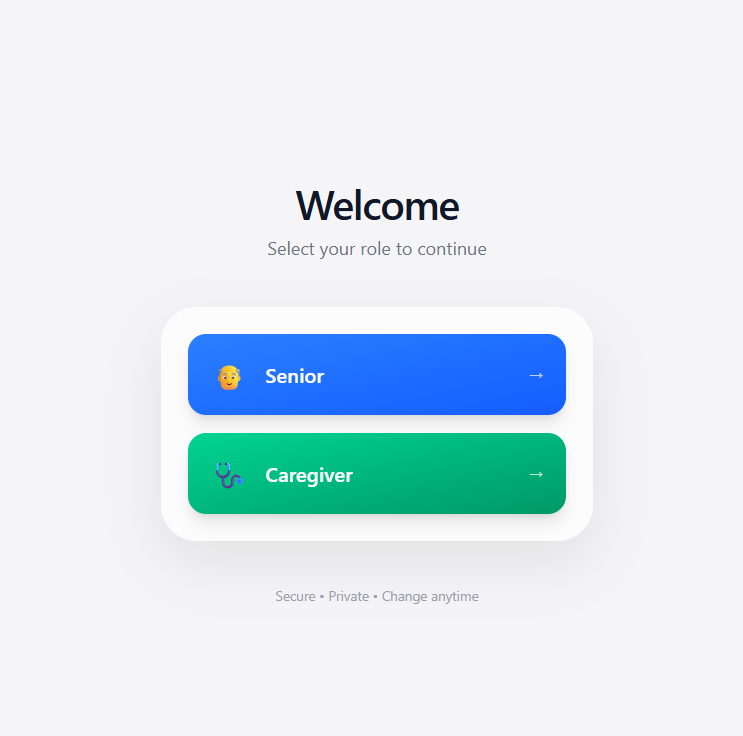
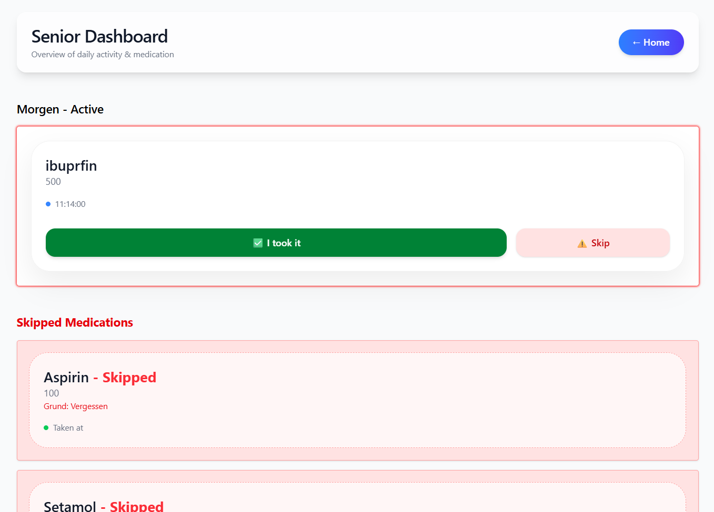
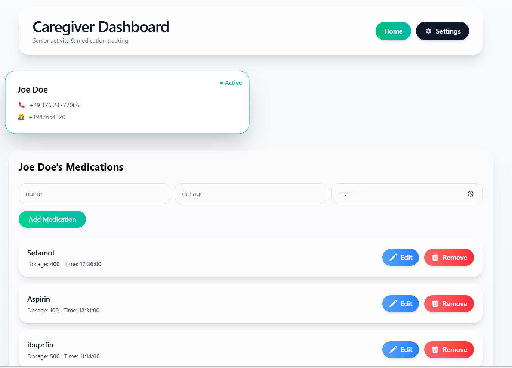
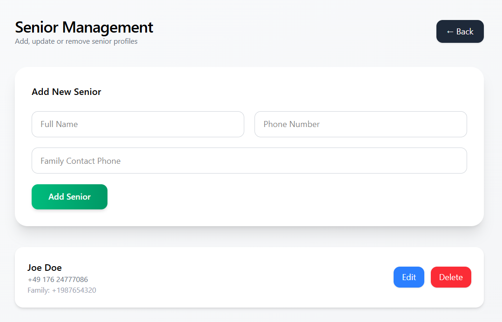

# Medora Fullstack App – Spring Boot & React


---

---

---

---


Medora is a fullstack application designed for caregivers and seniors to manage daily medications, track adherence, and receive real-time notifications. It features dedicated dashboards for admins (caregivers) and seniors, powered by a **Spring Boot backend** and a **React frontend**.

---

## Table of Contents

- [Features](#features)
- [Tech Stack](#tech-stack)
- [Project Structure](#project-structure)
- [Getting Started](#getting-started)
- [API Endpoints](#api-endpoints)
- [Components Overview](#components-overview)
- [State Management &amp; Local Storage](#state-management--local-storage)
- [Screenshots](#screenshots)
- [License](#license)

---

## Features

### Admin Dashboard

- Manage seniors and their profiles.
- Add, edit, or delete medications for any senior.
- Track medications taken or skipped daily.
- Automatic daily reset for skipped medications.
- Receive notifications for missed or overdue medications.
- PIN-protected settings page for enhanced security.

### Senior Dashboard

- View daily medications categorized by time (morning, afternoon, evening).
- Mark medications as **taken** or **skipped** with optional reasons.
- Access historical medication logs.
- Receive real-time notifications and reminders.

### Shared Features

- Persistent data using `localStorage` for skipped medications and acknowledged notifications.
- Responsive design using Tailwind CSS with modern gradient UI.
- Seamless integration with backend API via Axios.

---

## Tech Stack

- **Frontend:** React, React Router, Tailwind CSS
- **State Management:** React Hooks (`useState`, `useEffect`, `useMemo`), Context API
- **HTTP Requests:** Axios
- **Backend:** Spring Boot (Java 17+)
  - RESTful API endpoints
  - Data persistence using H2 (development) or MySQL/PostgreSQL (production)
  - User and medication management
  - Notification tracking and logging
- **Local Storage:** Daily medication resets, skipped medications, acknowledged notifications

---

## Project Structure

```text
medora/
├── backend/                 # Spring Boot backend
│   ├── src/main/java/com/medora
│   │   ├── controller       # REST controllers
│   │   ├── model            # Entities & DTOs
│   │   ├── repository       # JPA repositories
│   │   └── service          # Business logic
│   └── src/main/resources
│       └── application.yml  # Configuration
├── frontend/                # React frontend
│   ├── src/
│   │   ├── components/      # React components
│   │   ├── pages/           # Admin & Senior pages
│   │   ├── context/         # Context API for global state
│   │   └── services/        # Axios API calls
│   └── tailwind.config.js   # Tailwind configuration
└── README.md
```
